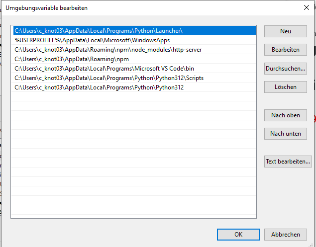

# Starting Instructions for the Exponat

This document should give instructions to start the Exponat on the PC in Room 201 in the Ifgi.

Login with an account. The LAN cable should be connected in Room 201 to the LAN socket in the floor tank at the long window side.

## Setting up, when using a new user

Install from the offical websites:

- Visual Studio Code
- Python

Install http-server with the following command at the path `C:/Users/Public/Documents/windpark-simulator`:
`npm install --global http-server`

Make sure all the environment variables are defined like so:

Before starting the python skripts install the following packages with `pip install`:

- requests
- opencv-python

> **_NOTE:_** Before starting everything rotate the knobs which display the windspeed and -direction in the starting postition. For the windspeed it is 0 km/h and for the winddirection it is Northwind.

## Start the http-server

1. Open the cmd
2. Navigate to `C:/Users/Public/Documents/windpark-simulator`
3. To build all dependencies type `npm run build`. This is only necessary, when something new has been added.
4. Type `http-server -c-1`
5. Use the appeared link later to open the dashboard and the city.

## Start the server

1. Open VSCode.
2. Navigate to `C:/Users/Public/Documents/windpark-simulator/server`
3. Type in the terminal: `npm start`

## Start the python scripts

1. Open another VSCode Window.
2. Navigate to `C:/Users/Public/Documents/scanner/CS_CityScoPy-3.2`
3. You can calibrate the camera. This should be done, when the camera doesn´t recognize the tiles correctly anymore. Type `python calibrate.py` or `py calibrate.py`. Because the camera is rotated by 90 degrees, you have to click in the exact corners in the following order: top left, bottom left, top right, bottom right.
4. Type `python run.py` or `py run.py`
5. A window should open, which displays the cameraview and the recognized white and black cells.

## Open the dashboard

1. Open the Firefox.
2. Type the copied link and add `/dashboard`, e.g. `http://10.67.64.13:8081/dashboard`.
3. Push F11 to open the full screen modus.

## Open the city

1. Open another Firefox window.
2. Type the copied link and add `/city`, e.g. `http://10.67.64.13:8081/city`.
3. Push F11 to open the full screen modus.
4. To move it to the beamer press Windows+Shift+Arrow Left/Right.
5. When the projected city doesn´t match the bricks you have to edit the CSS:
   1. Press F12 to open the Inspector
   2. Use the tool "Select element on the site (Element auf der Seite auswählen)" and click on the canvas. Then navigate to the element `
`
   3. Edit the properties `max-width` and `max-height` so it fits with the table. From experience the value `885px` was good, but it can differ.

## Get the knobs to work

The knobs only work, when the Firefox Window with the City is in focus. To do that, click in the window.
